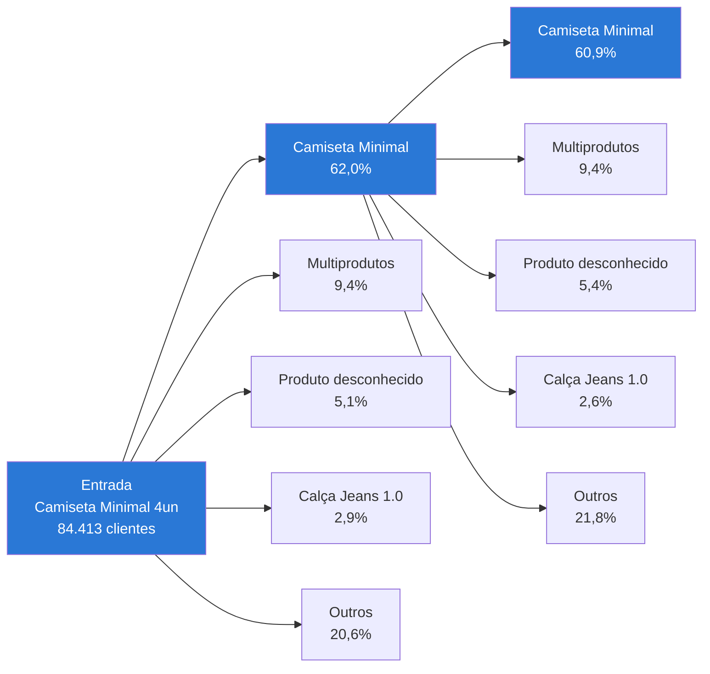

# Jornada de Produto — o Problema do Cross-Sell (Resumo)

> Rascunho pra validação do Daniel. Depois de aprovado, decide o próximo passo (o que sobe pra aba Recompra do `gerenciadordecrm.com` e o que fica só de diagnóstico).

## Status

A análise de Jornada de Produto foi **construída e validada localmente** (`mc-growth/jornada_produto.py`, dado completo em `mc-growth/docs/sessions/2026-07-23-jornada-de-produto.md`) — mas **ainda não subiu pra aba Recompra do `gerenciadordecrm.com`**. Este documento resume o achado mais importante dessa análise antes de decidirmos o que efetivamente sobe pra produção.

## A entrega principal: a árvore da jornada

A forma mais direta de mostrar o problema é ver, literalmente, pra onde o cliente vai depois da entrada. As árvores abaixo usam os 4 caminhos mais comuns em cada compra (o resto agrupado em "Outros") — dado real, sem filtro.

### Quem entra com Camiseta Minimal (kit de 4un — a maior entrada da base, 84.413 clientes)

*Leitura: das 26.275 pessoas que chegam à 2ª compra (só 31% da entrada — a maioria nem volta), 62% compram Camiseta Minimal de novo. Desses 16.290, só 43,3% chegam a uma 3ª compra — e, de quem chega, 60,9% compra Camiseta Minimal PELA TERCEIRA VEZ. É a mesma peça, repetida, pra maioria de quem continua comprando.*

### Jeans não é exceção — mas vale olhar as 3 cores separadamente

Calça Jeans 1.0 é a entrada solo que mais se aproxima de um cross-sell saudável (é uma categoria própria, não depende de camiseta pra existir). Abrindo pelas 3 cores/SKUs que respondem por quase toda a linha (Azul Médio Escuro, Azul Claro, Preta — juntas, 92% do volume; a 4ª variante, Azul Médio, é residual e não entra):

| Cor de entrada    | Clientes | Chegam à 2ª compra | 2ª compra: Jeans de novo | 2ª compra: Camiseta Minimal | 2ª compra: Multiprodutos |
| ----------------- | -------: | -----------------: | -----------------------: | --------------------------: | -----------------------: |
| Azul Médio Escuro |    2.249 |              23,7% |                    26,1% |                       16,9% |                    11,8% |
| Azul Claro        |    1.736 |              27,3% |                    36,9% |                       18,1% |                    13,3% |
| Preta             |    1.330 |              25,6% |                    33,7% |                       20,2% |                    10,9% |

**Leitura:** diferente de todas as outras entradas da base, aqui o próprio Jeans vence como recompra nas 3 cores (26–37%) — é a única categoria que sustenta hábito próprio sem depender de Camiseta Minimal. Ainda assim, Camiseta Minimal aparece como 2º lugar forte em todas as 3, e só 1 em cada 4 clientes chega a uma 2ª compra. Azul Claro tem a auto-repetição mais forte das 3 (36,9%) — candidata a cor-âncora se a marca quiser dobrar a aposta em Jeans como porta de entrada.

## O tamanho do problema, em toda a base

A árvore acima não é exceção — é o padrão. Olhando o produto que mais se repete na 2ª compra, entrada por entrada (todas as 20 entradas elegíveis da base):

| Entrada | Quem repete MAIS na 2ª compra |
|---|---|
| Camiseta Minimal (qualquer quantidade) | A própria Camiseta Minimal (62–75%) |
| Camiseta + Jeans, +Cueca, +Fitness, +Carteira, +Social, +Perfume | **Camiseta Minimal — não o segundo produto do combo** |
| Calça Jeans 1.0, Camisa Social, Camisa Henley, Overshirt, Polo 2.0, Calça Comfort | O próprio produto da entrada (autorrepetição) |

**Conclusão direta:** existem só 2 padrões na base inteira. Ou (1) o cliente repete exatamente o que já comprou, ou (2) — sempre que Camiseta Minimal está em algum lugar da história dele — ele volta pra Camiseta Minimal. **Em nenhum caso um produto NOVO, fora do que ele já experimentou, vira a escolha dominante.** Isso É o cross-sell não acontecendo.

## Por que isso importa pra Recompra

- **A maioria não volta:** 57–92% dos que entram, dependendo da entrada, nunca fazem 2ª compra. Isso já é a maior alavanca — antes de discutir QUE produto oferecer, falta gente sequer voltando.
- **De quem volta, a diversidade de produto é baixa:** os números acima mostram isso direto — sem intervenção ativa, o cliente não se move pra categoria nova sozinho.
- **Combos aceleram o retorno, mas não resolvem o cross-sell:** entradas por combo voltam mais rápido que camiseta sozinha, mas o produto recomprado continua sendo Camiseta Minimal, não o segundo item do combo — o combo ANTECIPA a recompra, não DIVERSIFICA ela.
- **A pesquisa qualitativa e a quantitativa concordam:** na Pesquisa Pós-Compra, "calça" foi o produto mais citado espontaneamente como próxima compra desejada (42 menções) — mas o comportamento real mostra isso quase não acontecendo sozinho. Existe intenção declarada que o comportamento não confirma — o que é exatamente o tipo de lacuna que uma comunicação ativa de cross-sell (e não a jornada orgânica) precisa preencher.
